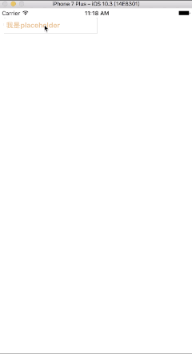

# CCTextView

## Screenshot




A UITextView which support placehold and dynamic height

基于UITextView封装的一个输入组件。支持自适应高度，使用方法参见demo。谢谢🙏

## Usage

create CCTextView like a UIView
```objectivec
self.ccTextView = [[CCTextView alloc]initWithFrame:CGRectMake(10, 20, 200, 34)];
//set property
[self.ccTextView setPlaceholderOpacity:.5];
[self.ccTextView setPlaceholderColor:[UIColor orangeColor]];
[self.ccTextView setPlaceholderFont:[UIFont boldSystemFontOfSize:15]];

//swich this property can change it dynamic height ablity,default is NO
self.ccTextView.shouldAutoUpdateHeight = YES;
```
Of course there are some events that callback
```objectivec
[self.ccTextView addTextViewBeginEvent:^(CCTextView *textView) {
    NSLog(@"CCTextView开始编辑");
}];

[self.ccTextView addTextViewEndEvent:^(CCTextView *textView) {
    NSLog(@"CCTextView结束编辑");
}];

[self.ccTextView TextViewDidUpdateHeightEvent:^(CCTextView *textView) {
    NSLog(@"CCTextView更新高度了%f",textView.frame.size.height);
}];

```


## License

CCTextView is available under the MIT license. See the LICENSE file for more info.
